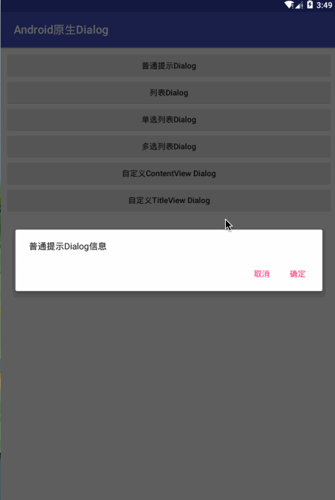

# 1. 简介

本项目主要学习了Android原生的Dialog使用方式.Dialog 是一个可以展示信息以及和用户交互的小窗体.

## 1.1 Dialog 的组成部分
- Title 标题部分 : 这部分是可选的,只有当内容区域被使用了才可以使用这里.(并不是强制的)
- Content 内容区域 : 显示信息的部分,可以使用自定义布局.
- Action Buttons 交互按钮 : 最多三个按钮.(Positive,Negative, Neutral)

## 1.2 管理Dialog
使用DialogFragment来管理Dialog可以正确处理生命周期事件. 我们可以创建各种各样的Dialog,当然可以自定义UI.


# 2 分类
**对于系统的原生的Dialog主要有下面几种 :**

- 普通提示Dialog.
- 列表Dialog.
- 单选列表Dialog.
- 多选列表Dialog.
- 自定义ContentView Dialog.
- 自定义TitleView Dialog.

**先看效果图**



## 2.1 普通提示Dialog

**实现代码**

```java
/**
 * 普通提示Dialog.
 */
public static class NormalTextDialogFragment extends DialogFragment {
    /**
     * 创建Dialog时调用
     */
    @NonNull
    @Override
    public Dialog onCreateDialog(Bundle savedInstanceState) {
        Log.d(TAG, "onCreateDialog: ");
        // 创建构造器
        AlertDialog.Builder builder = new AlertDialog.Builder(getActivity());
        // 设置参数
        builder.setMessage("普通提示Dialog信息")
                .setPositiveButton("确定", new DialogInterface.OnClickListener() {
                    @Override
                    public void onClick(DialogInterface dialog, int which) {
                        Log.d(TAG, "onClick: 确定 " + Thread.currentThread().getId());
                        Toast.makeText(getActivity(), "点击了确定", Toast.LENGTH_SHORT).show();
                    }
                })
                .setNegativeButton("取消", new DialogInterface.OnClickListener() {
                    @Override
                    public void onClick(DialogInterface dialog, int which) {
                        Log.d(TAG, "onClick: 取消 " + Thread.currentThread().getId());
                        Toast.makeText(getActivity(), "点击了取消", Toast.LENGTH_SHORT).show();
                    }
                });
        // 创建对话框并返回.
        return builder.create();
    }
}
```

**调用方式**


```
// 创建类实例,调用 show() 方法就可以显示了.
new NormalTextDialogFragment().show(getSupportFragmentManager(), "normal_text_dialog");
```

## 2.2 列表Dialog

```
/**
 * 列表Dialog
 */
public static class ListDialogFragment extends DialogFragment {
    @NonNull
    @Override
    public Dialog onCreateDialog(Bundle savedInstanceState) {
        AlertDialog.Builder builder = new AlertDialog.Builder(getActivity());
        return builder
                .setTitle("颜色选择")
                .setItems(R.array.color_arrays, new DialogInterface.OnClickListener() {
                    @Override
                    public void onClick(DialogInterface dialog, int which) {
                        // 获取列表
                        String[] colors = getResources().getStringArray(R.array.color_arrays);
                        // 显示
                        Toast.makeText(getActivity(), "选择了 " + colors[which], Toast.LENGTH_SHORT).show();
                    }
                })
                .create();
    }
}
```

## 2.3 单选Dialog

```java
/**
 * 单选框Dialog
 */
public static class SingleChoiceDialogFragment extends DialogFragment {
    @NonNull
    @Override
    public Dialog onCreateDialog(Bundle savedInstanceState) {
        return new AlertDialog.Builder(getActivity())
                .setSingleChoiceItems(R.array.color_arrays, 0, new DialogInterface.OnClickListener() {
                    @Override
                    public void onClick(DialogInterface dialog, int which) {
                        // 获取列表
                        String[] colors = getResources().getStringArray(R.array.color_arrays);
                        // 显示
                        Toast.makeText(getActivity(), "选择了 " + colors[which], Toast.LENGTH_SHORT).show();
                    }
                })
                .setPositiveButton("OK",null)
                .setNegativeButton("Cancel", null)
                .create();
    }
}
```

## 2.4 多选Dialog

```java
/**
 * 多选项Dialog
 */
public static class MultiChoiceDialogFragment extends DialogFragment {

    @NonNull
    @Override
    public Dialog onCreateDialog(Bundle savedInstanceState) {

        return new AlertDialog.Builder(getActivity())
                .setMultiChoiceItems(R.array.color_arrays, null, new DialogInterface.OnMultiChoiceClickListener() {
                    @Override
                    public void onClick(DialogInterface dialog, int which, boolean isChecked) {
                        // 获取列表
                        String[] colors = getResources().getStringArray(R.array.color_arrays);
                        // 显示
                        String txt = "点击了: " + colors[which] + " == " + isChecked;
                        Toast.makeText(getActivity(), txt, Toast.LENGTH_SHORT).show();
                    }
                })
                .setPositiveButton("OK", null)
                .setNegativeButton("Cancel", null)
                .create();
    }
}
```

## 2.5 自定义ContentView

```java
/**
 * 自定义Content
 */
public static class CustomContentDialogFragment extends DialogFragment {
    @NonNull
    @Override
    public Dialog onCreateDialog(Bundle savedInstanceState) {
        AlertDialog.Builder builder = new AlertDialog.Builder(getActivity());

        return builder
                .setView(R.layout.dialog_custom_content)
                .setPositiveButton("OK" , null)
                .setNegativeButton("Cancel", null)
                .create();
    }
}
```

## 2.6 自定义Title

```java
/**
 * 自定义标题Dialog
 */
public static class CustomTitleDialogFragment extends DialogFragment {
    @NonNull
    @Override
    public Dialog onCreateDialog(Bundle savedInstanceState) {
        AlertDialog.Builder builder = new AlertDialog.Builder(getActivity());

        LayoutInflater li = getActivity().getLayoutInflater();

        return builder
                .setCustomTitle(li.inflate(R.layout.dialog_custom_title, null))
                .setPositiveButton("OK" , null)
                .setNegativeButton("Cancel", null)
                .create();
    }
}
```


